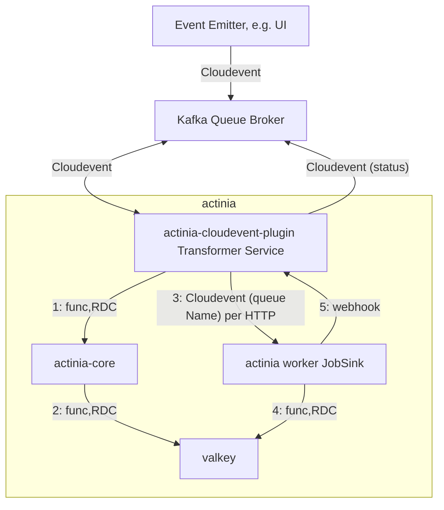
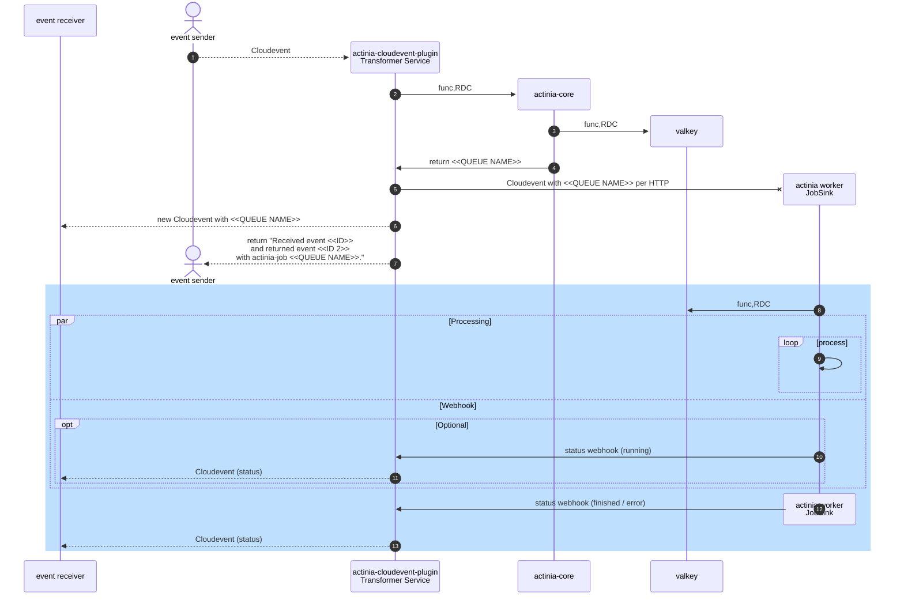

# actinia-cloudevent-plugin

This is a plugin for [actinia-core](https://github.com/mundialis/actinia_core) which translates cloudevents into a process definition
for actinia-core and runs as standalone app.

## Installation and Setup

Use docker-compose for installation:
```bash
docker compose -f docker/docker-compose.yml build
docker compose -f docker/docker-compose.yml up -d
```

### DEV setup with vscode
1. Start actinia-core locally via local dev-setup as described in the
[actinia-docker repository](https://github.com/actinia-org/actinia-docker#local-dev-setup-for-actinia-core-plugins-with-vscode)
2. Have this repository open locally with vscode and press `F5`.
After a few seconds, a browser window should be openend, pointing to
an endpoint (showing 405 Method Not Allowed as this plugin has only
HTTP POST endpoints so far).

Alternatively, configure actinia-core to run jobs via actinia-worker.
In the actinia-core dev-setup, use the `per_job` queue in
`actinia-docker/actinia-dev/actinia.cfg`:
```
[QUEUE]
# queue_type = local

[QUEUE]
queue_type = per_job
kvdb_queue_server_url = valkey
kvdb_queue_server_password = pass
worker_queue_prefix = job_queue
```
And restart the vscode debugger. This way, a job is registered in the
valkey DB, but not directly started.


<!-- TODO: check update docker-compose DEV setup if needed -->
<!-- ```bash
# Uncomment the volume mount of the cloud-event-plugin within docker/docker-compose.yml,
# then:
docker compose -f docker/docker-compose.yml build
docker compose -f docker/docker-compose.yml run --rm --service-ports --entrypoint sh actinia-cloudevent
# within docker
# install the plugin
pip3 install .
# start flask app with actinia-cloudevent-plugin
gunicorn -b 0.0.0.0:5000 -w 8 --access-logfile=- -k gthread actinia_cloudevent_plugin.main:flask_app
# or directly via python
python3 -m actinia_cloudevent_plugin.main
``` -->

## Configuration

- the URL of actinia-core and the cloudevent receiver is defined
within [config/mount/sample.ini](config/mount/sample.ini): `
[EVENTRECEIVER]` (Default value defined within
[src/actinia_cloudevent_plugin/resources/config.py](src/actinia_cloudevent_plugin/resources/config.py))

## Requesting endpoint
**Note**: Assuming cloudevent-plugin is running as described in previous setup.

You can test the plugin and request the `/` endpoint, e.g. with:
```bash
JSON=tests/examples/cloudevent_example.json
curl -X POST -H 'Content-Type: application/json' --data @$JSON localhost:3003/
```
Or test with `per_job` queue
```bash
JSON=tests/examples/cloudevent_example.json
curl -X POST -H 'Content-Type: application/json' --data @$JSON localhost:3003/
# Get the actinia job queue name from the response
QUEUE_NAME=job_queue_resource_id-d4d9be86-5938-47ff-9c6d-7c79964862c0

docker run --rm --network actinia-docker_actinia-dev \
  -v $HOME/actinia/grassdb:/actinia_core/grassdb \
  -v $HOME/actinia/grassdb_user:/actinia_core/userdata \
  --entrypoint actinia-worker actiniacore -q $QUEUE_NAME
```

Exemplary returned cloudevent: [tests/examples/cloudevent_example_return.json](tests/examples/cloudevent_example_return.json)


## Running tests
You can run the tests in the actinia test docker.
These are the same steps which the github workflow is executing.

```bash
docker compose -f docker/docker-compose.yml up -d --build
sleep 10 && \
    docker logs docker-actinia-cloudevent-1 && echo && \
    docker logs docker-actinia-core-1 && echo && \
    docker logs docker-event-receiver-server-1
docker exec -t docker-actinia-cloudevent-1 make integrationtest
docker compose -f docker/docker-compose.yml down
```

---

## Possible setup


---

<!-- <script>
  mermaid.initialize({ sequence: { showSequenceNumbers: true } });
</script> -->


---
